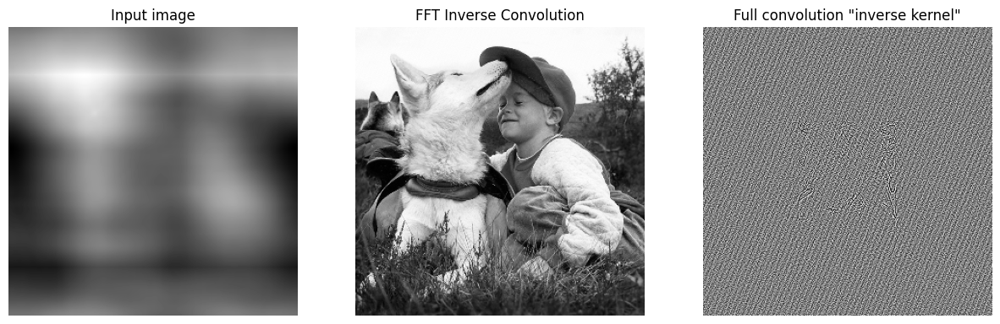

# Simple invertible FFT convolutions

Convolution operations are equivalent to multiplication by Toeplitz matrices, and as a result they can often be invertible operations. A circular convolution is especially easy to invert because its corresponding matrix is a circulant matrix, which is diagonal in the Fourier basis; this is the Convolution Theorem. Thus it is (theoretically) easy and efficient to invert circular convolutions by changing the basis of the convolution operation to the Fourier basis using FFT and then inverting each of the diagonal elements of the (now diagonal) convolution matrix.

Using this strategy to invert the native PyTorch convolution implementations is a bit tricky, though, because the PyTorch definition of a convolution is different from the definition of a convolution in the Convolution Theorem. Specifically, the Convolution Theorem version is shifted and inverted (in all dimensions):

This repo provides minimalist implementations of 1D and 2D invertible FFT convolutions that are compatible with torch.nn.Conv1D and torch.nn.Conv2D. The goal here is simplicity, so no attempt is made to replicate strides and the number of channels is fixed at 1. 

**Implementations:**

 - 1D convolutions and inverses: fft_conv1d.py
 - 2D convolutions and inverses: fft_conv2d.py

**Example usage:**

 - 1D convolutions and inverses: test_fft_conv1d.py
 - 2D convolutions and inverses: test_fft_conv2d.py

## Other resources

I recommend the paper [Orthogonalizing Convolutional Layers with the Cayley Transform](https://arxiv.org/abs/2104.07167), which discusses invertible convolutions and other, more advanced uses of FFT convolutions. Their [github repo](https://github.com/locuslab/orthogonal-convolutions/tree/main) provides two especially useful files:

 - [FFT convolutions.ipynb:](https://github.com/locuslab/orthogonal-convolutions/blob/main/FFT%20Convolutions.ipynb) pedagogical walkthrough notebook for building FFT convolutions
 - [fftconv.py](https://github.com/locuslab/orthogonal-convolutions/blob/main/extras/fftconv.py): implementation of FFT convolution that is fully compatible with (and, indeed, subclassed from) torch.nn.Convd2d, including functionality for channels and strides.
